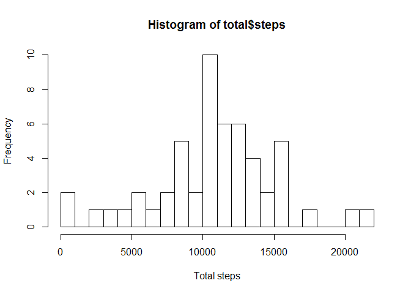

# Reproducible Research: Peer Assessment 1

###Introduction
It is now possible to collect a large amount of data about personal movement using activity monitoring devices such as a Fitbit, Nike Fuelband, or Jawbone Up. These type of devices are part of the "quantified self" movement -- a group of enthusiasts who take measurements about themselves regularly to improve their health, to find patterns in their behavior, or because they are tech geeks. But these data remain under-utilized both because the raw data are hard to obtain and there is a lack of statistical methods and software for processing and interpreting the data.
This assignment makes use of data from a personal activity monitoring device. This device collects data at 5 minute intervals through out the day. The data consists of two months of data from an anonymous individual collected during the months of October and November, 2012 and include the number of steps taken in 5 minute intervals each day.

###Data
*Dataset:* Activity monitoring data 

The variables included in this dataset are:

*steps:* Number of steps taking in a 5-minute interval (missing values are coded as NA)

*date:* The date on which the measurement was taken in YYYY-MM-DD format

*interval:* Identifier for the 5-minute interval in which measurement was taken

More information can be found in README.md.

## Loading and preprocessing the data

```r
Sys.setlocale(category = "LC_ALL",locale = "English")
```

```
## [1] "LC_COLLATE=English_United States.1252;LC_CTYPE=English_United States.1252;LC_MONETARY=English_United States.1252;LC_NUMERIC=C;LC_TIME=English_United States.1252"
```

```r
AMD <- read.csv("activity.csv", header = TRUE)
names(AMD)
```

```
## [1] "steps"    "date"     "interval"
```

```r
str(AMD)
```

```
## 'data.frame':	17568 obs. of  3 variables:
##  $ steps   : int  NA NA NA NA NA NA NA NA NA NA ...
##  $ date    : Factor w/ 61 levels "2012-10-01","2012-10-02",..: 1 1 1 1 1 1 1 1 1 1 ...
##  $ interval: int  0 5 10 15 20 25 30 35 40 45 ...
```

```r
head(AMD)
```

```
##   steps       date interval
## 1    NA 2012-10-01        0
## 2    NA 2012-10-01        5
## 3    NA 2012-10-01       10
## 4    NA 2012-10-01       15
## 5    NA 2012-10-01       20
## 6    NA 2012-10-01       25
```
 
## What is mean total number of steps taken per day?

```r
library(dplyr)
```

```
## 
## Attaching package: 'dplyr'
## 
## The following objects are masked from 'package:stats':
## 
##     filter, lag
## 
## The following objects are masked from 'package:base':
## 
##     intersect, setdiff, setequal, union
```
### Grouping by date

```r
library(dplyr)
total_day <- group_by(AMD, date)
```
### Total steps by day

```r
total <- aggregate(total_day$steps, by=list(total_day$date), FUN = sum)
names(total) <- c("date", "steps")
```
### Histogram 

```r
hist(total$steps, xlab = "Total steps", breaks = 20)
```

 

### Mean and median

```r
mean_step <- mean(total$steps, na.rm = TRUE)
median_step <- median(total$steps, na.rm = TRUE)
cat("Mean:",mean_step)
```

```
## Mean: 10766.19
```

```r
cat("Median:", median_step)
```

```
## Median: 10765
```


## What is the average daily activity pattern?
### Gruping by interval

```r
by_interval <- group_by(AMD, interval)
```

### Average steps by interval

```r
ASI <- aggregate(by_interval$steps, by=list(by_interval$interval), FUN = mean, na.rm = TRUE)
names(ASI) <- c("interval", "steps")
with(ASI, plot(interval, steps, type="l", main = "Average steps by time interval"))
```

 

###Maximum number of steps by time interval

```r
maximum_steps <- ASI[which.max(ASI$steps), c("interval")]
cat("Maximum steps by interval:",  maximum_steps)
```

```
## Maximum steps by interval: 835
```

## Imputing missing values
### Total number of rows with NA

```r
cat("Rows with NA:", sum(is.na(total_day$step)))
```

```
## Rows with NA: 2304
```

### Replace NA values with the average by interval
First I merge the original dataset with the dataset grouped by interval.

```r
merged_total_day<- merge(x= total_day, y = ASI, by = "interval", all.x = TRUE)
merged_total_day[is.na(merged_total_day$steps.x), c("steps.x")] <- merged_total_day[is.na(merged_total_day$steps.x), c("steps.y")]
merged_total_day$steps.y <- NULL
```
### Histogram of the replaced set, mean, median

```r
total_new <- aggregate(merged_total_day$steps.x, by=list(merged_total_day$date), FUN = sum)
names(total_new) <- c("date", "steps")

hist(total_new$steps, xlab = "Total steps with replacement", breaks = 20)
```

 

```r
mean_replaced <- mean(total_new$steps)
median_replaced <- median(total_new$steps)

cat("Original mean:",mean_step, "Replaced mean:", mean_replaced)
```

```
## Original mean: 10766.19 Replaced mean: 10766.19
```

```r
cat("Original median:", median_step, "Replaced median:", median_replaced)
```

```
## Original median: 10765 Replaced median: 10766.19
```
There is almost no difference between the original mean and median and replaced ones. 

## Are there differences in activity patterns between weekdays and weekends?
### Weekends or weekdays

```r
merged_total_day$day <- weekdays(as.Date(as.character(merged_total_day$date)))
merged_total_day$daytype <- as.factor(c("Weekday", "Weekend"))
weekend <- merged_total_day$day == "Saturday" | merged_total_day$day == "Sunday"
merged_total_day$daytype[weekend] = "Weekend"
merged_total_day$daytype[!weekend] = "Weekday"
merged_total_day$daytype <- as.factor(merged_total_day$daytype)
```

### Plot in weekdays and weekends

```r
MTDI <- aggregate(merged_total_day$steps.x,by=list(merged_total_day$interval,merged_total_day$daytype), FUN = mean)
names(MTDI) <- c("interval","daytype", "steps")
```

```r
library(lattice)
xyplot(steps~interval | daytype, data = MTDI,
       type = "l",
       xlab = "Interval",
       ylab = "Number of Steps",
       main = "Average steps by time interval",
       layout = c(1,2)) 
```

 
                   
